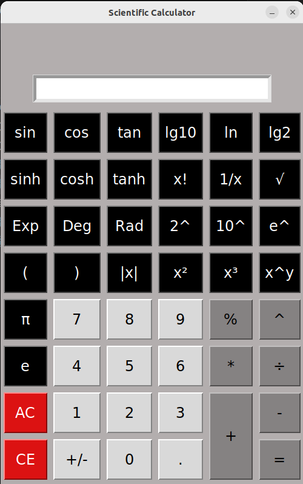

<h1 align='center'> Scientific calculator - Python Tkinter </h'>

<p align='center'>


</p>


## 📂 Table of contents

- [What is Tkinter?](#what-is-tkinter)
- [📝 Description](#-description)
- [💾 Installation](#-installation)
- [⚙️ Requirements](#️-requirements)
- [✨ Features](#-features)
- [📸 Screenshots](#-screenshots)
- [🧾 License](#license)
- [📽️ Demo](#demo)


## What is Tkinter?


[**Tkinter**](https://docs.python.org/3/library/tkinter.html) is the standard GUI library for Python. It allows developers to create desktop applications with simple widgets like buttons, labels, entries, etc. Tkinter is built into Python, so no additional installation is required for most environments.


## 📝 Discription

This project is a modern Scientific Calculator built with Python and Tkinter, designed to provide a clean and intuitive user experience across platforms.

It supports basic arithmetic and advanced functions like trigonometry, logarithms, exponents, square roots, and constants (π, e). The layout is designed to resemble a real scientific calculator, offering a user-friendly and functional GUI.


## 💾 Installation

1. Clone thin repository:
```
git clone https://github.com/shiva-rsl/Python_Tkinter_Calculator.git
```

2. Navigate to the project directory:
```
cd Python_Tkinter_Calculator
```

3. Run the calculator:
```
python calculator_tkinter.py
```

## ⚙️ Requirements


- Python 3.12+
- Tkinter (comes pre-installed with Python)


## ✨ Features

- Standard operations: `+`, `-`, `×`, `÷`, `%`, etc.

- Scientific functions: `sin`, `cos`, `tan`, `sinh`, `log`, `ln`, `sqrt`, `factorial`, `^`, etc.

- Use of Unicode symbols: `√`, `π`, `e`, etc.

- Parentheses support for complex expressions

- Negative number handling

- `CE` and `AC` buttons

- Mouse-driven interface (no need for typing)

- Designed for cross-platform compatibility (Linux, Windows, macOS)


## 📸 Screenshots

Light-themed scientific calculator with GUI buttons




## 🧾 License

This project is licensed under the MIT License. 

For more information please view the [license description](https://choosealicense.com/licenses/mit/).


## 📽️ Demo

Coming soon...

